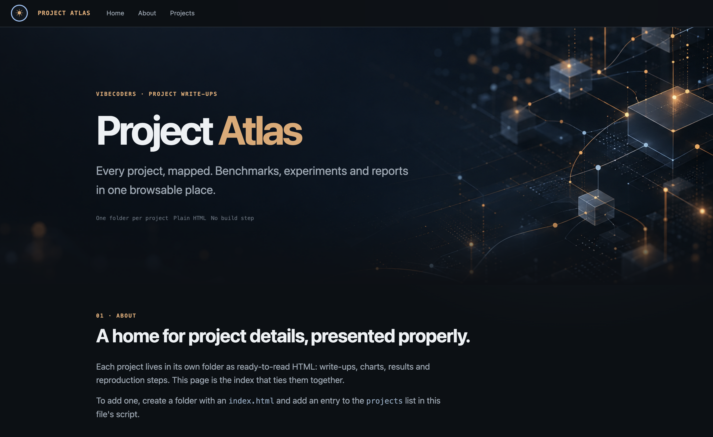

<div align="center">

# Project Atlas

**Every project, mapped. Benchmarks, experiments and reports in one browsable place.**

[](https://www.imdadareeph.com/project-atlas/)

[](LICENSE)
[](https://www.imdadareeph.com/project-atlas/)
[](index.html)
[](#adding-a-project)
[](#features)
[](https://github.com/imdadareeph/project-atlas/commits/main)
[](#credits)



### [→ Open Project Atlas](https://www.imdadareeph.com/project-atlas/)

</div>

---

## What is Project Atlas?

Project Atlas is a personal gallery of project write-ups. The goal is simple: **keep each project's details in its own folder as plain HTML files, and present them properly**, with real design, charts, tables and reproduction steps instead of a long README.

The root `index.html` is the home page. It lists every project as a card in a grid, and each card opens that project's own pages.

## Projects

| Project | What it covers | Open |
|---|---|---|
| **Repo Benchmarks** | How GitNexus, Graphify and CodeGraph compare on cold, warm and incremental indexing, measured on one machine with an independent harness. Wall time, CPU time and memory. | [Home](https://www.imdadareeph.com/project-atlas/repo-benchmarks/index.html) · [Benchmark page](https://www.imdadareeph.com/project-atlas/repo-benchmarks/gitnexus-graphify-codegraph-benchmark.html) |

More projects will be added over time.

## Features

- **Project grid** with cards for every project, and pagination once there are more than 6.
- **Dark and light themes.** Dark is the default, and a switcher sits at the top-left of the navbar. The choice is remembered in the browser.
- **Sticky navbar** with section links, and a Home link that goes back to the root page from every project page.
- **Back-to-top button** in the bottom-right corner once you scroll down.
- **Responsive layout** that works from phone to wide desktop.
- **Zero dependencies.** Plain HTML, CSS and a little JavaScript. No framework, no bundler, no `npm install`.

## Repository layout

```text
project-atlas/
├── index.html              # home page: hero, about, project grid
├── img/                    # shared images (hero banners for dark and light themes)
├── repo-benchmarks/        # one folder per project
│   ├── index.html          # project overview
│   └── gitnexus-graphify-codegraph-benchmark.html
├── LICENSE
└── README.md
```

## Run it locally

No build needed. Serve the folder with any static server:

```bash
git clone https://github.com/imdadareeph/project-atlas.git
cd project-atlas
python3 -m http.server 8000
# open http://localhost:8000
```

Opening `index.html` directly from disk also works for most pages.

## Adding a project

1. Create a new folder, for example `my-project/`, with an `index.html` inside.
2. Link back to the home page from it: `href="../index.html"`.
3. Add an entry to the `projects` array in the script at the bottom of the root `index.html`:

```js
{title:'My Project', tag:'REPORT', href:'my-project/index.html',
 desc:'One or two sentences on what this project is.',
 chips:['Tag one','Tag two']},
```

4. Commit and push. GitHub Pages publishes it at `https://www.imdadareeph.com/project-atlas/my-project/`.

## Deployment

The site is served by GitHub Pages from the `main` branch (root folder) and appears under the custom domain at **[imdadareeph.com/project-atlas](https://www.imdadareeph.com/project-atlas/)**. All links inside the pages are relative, so they work both locally and under the `/project-atlas/` path.

## License

Released under the [GNU General Public License v3.0](LICENSE).

## Credits

Created and maintained by **[@imdadareeph](https://github.com/imdadareeph)**.

<div align="center">

**@agenticcodingnewsletters**

</div>
